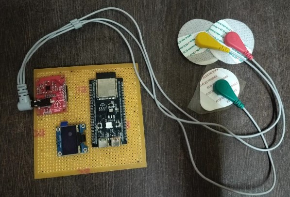
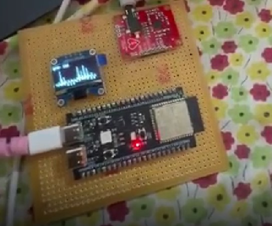
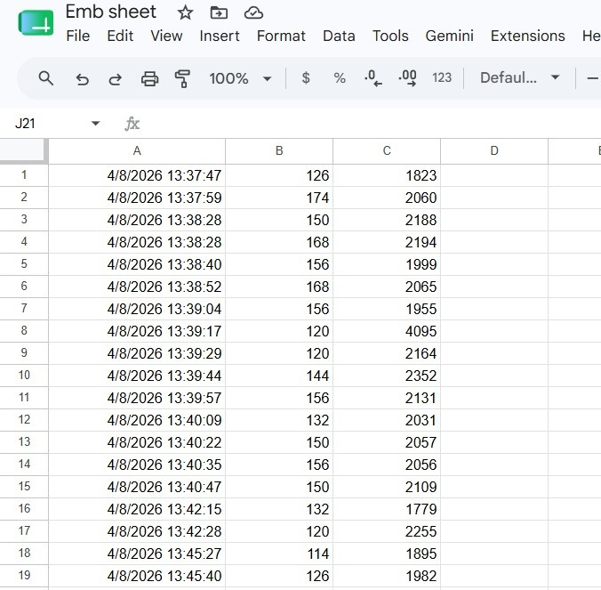

# ❤️ Real-Time ECG Monitoring & Cloud Logging System

A real-time ECG monitoring system built using **ESP32-S3**, **AD8232 ECG Sensor**, and **OLED Display** with cloud logging support using **Google Sheets**.

This project captures ECG signals, calculates BPM (Beats Per Minute), displays live ECG waveform on an OLED screen, and uploads data to Google Sheets over WiFi for remote monitoring and analysis.

---

## 🚀 Features

- 📈 Real-time ECG waveform monitoring
- ❤️ BPM (Heart Rate) calculation
- ☁️ Google Sheets cloud logging
- 📡 WiFi-enabled data transmission
- 🖥 OLED graphical display
- ⚡ Portable embedded healthcare solution

---

## 🛠 Components Used

| Component | Description |
|---|---|
| ESP32-S3 | Main microcontroller |
| AD8232 | ECG signal acquisition sensor |
| 0.96" OLED Display | Real-time waveform display |
| Electrodes | ECG signal capture |
| WiFi | Cloud communication |
| Google Sheets | Data storage |

---

## 🔌 Circuit Connections

### AD8232 to ESP32

| AD8232 Pin | ESP32 Pin |
|---|---|
| OUTPUT | GPIO 4 |
| LO+ | GPIO 5 |
| LO− | GPIO 18 |

### OLED to ESP32

| OLED Pin | ESP32 Pin |
|---|---|
| SDA | GPIO 8 |
| SCL | GPIO 9 |

All components share common GND and are powered using 3.3V.

---

## ⚙️ Working Principle

1. ECG electrodes capture heart electrical activity.
2. AD8232 amplifies and filters ECG signals.
3. ESP32 reads analog ECG data using ADC.
4. Threshold-based heartbeat detection calculates BPM.
5. ECG waveform is displayed live on OLED.
6. ECG and BPM data are uploaded to Google Sheets through WiFi.

---

## 💻 Technologies Used

- Embedded C / Arduino IDE
- ESP32 WiFi Library
- HTTPClient
- Adafruit SSD1306 Library
- IoT Cloud Logging
- Google Apps Script

---

## 📸 Project Preview

### Hardware Setup


### OLED Output


### Google Sheets Logging


---

## 📂 Project Structure

```bash
📁 ESP32-ECG-Monitoring-System
 ┣ 📄 ESP32-ECG-Monitoring-System.ino
 ┣ 📄 README.md
 ┣ 📄 Project_Report.pdf
 ┣ 📷 hardware_setup.jpg
 ┣ 📷 oled_output.jpg
 ┣ 📷 google_sheets.jpg
```

---

## 🎯 Applications

- Remote patient monitoring
- Portable healthcare devices
- Biomedical engineering projects
- IoT healthcare systems
- Academic research projects

---

## 🔮 Future Improvements

- Mobile app integration
- AI-based arrhythmia detection
- Cloud dashboard analytics
- Real-time emergency alerts
- Machine learning analysis

---

## 👩‍💻 Team Members

- Akshaya RG
- Shreyavarshini Subramanian
- Harshini Devendran

---

## 🎥 Demo Video

[Click Here to Watch Demo](https://drive.google.com/file/d/1kJ051DtXFDjc3sY_5ywT_XoaR7H_lqyE/)

---

## ⭐ Conclusion

This project demonstrates a low-cost and efficient real-time ECG monitoring system capable of displaying and storing heart activity data for remote healthcare monitoring and analysis.